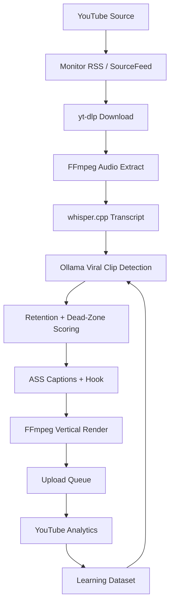
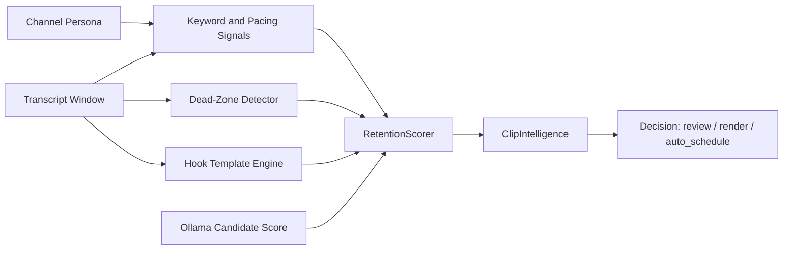
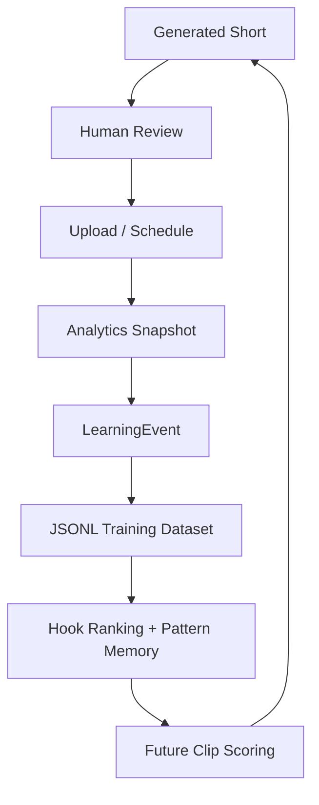
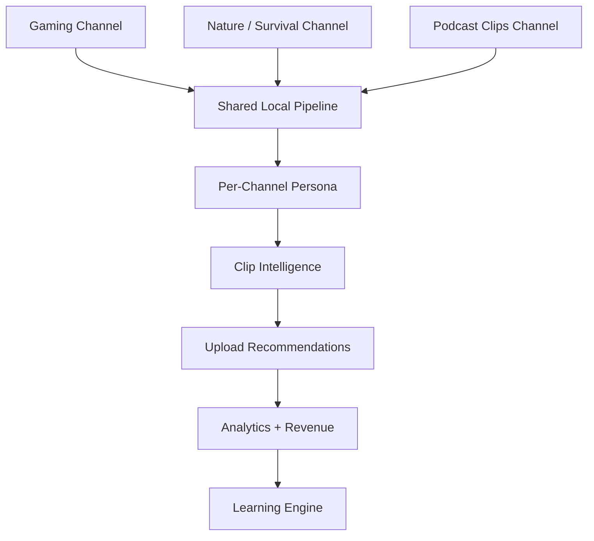
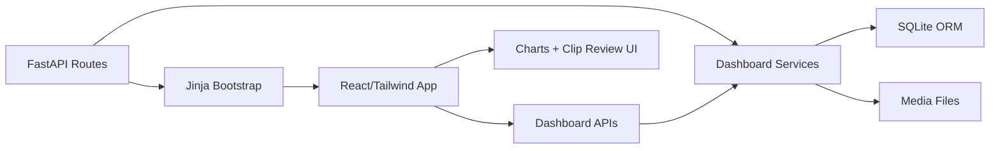
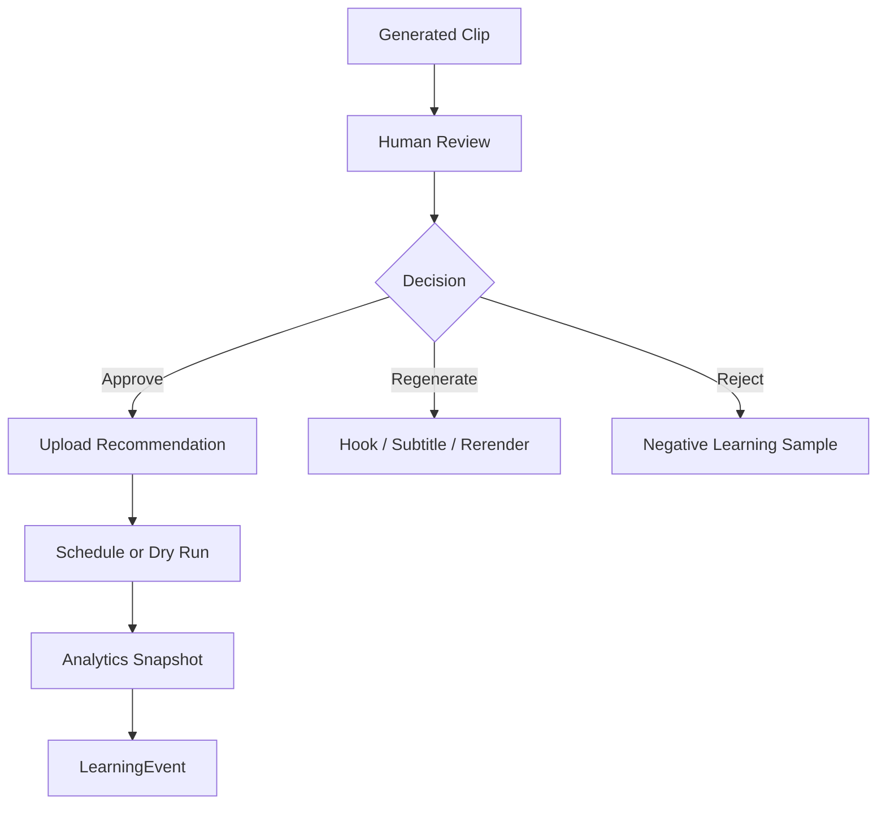
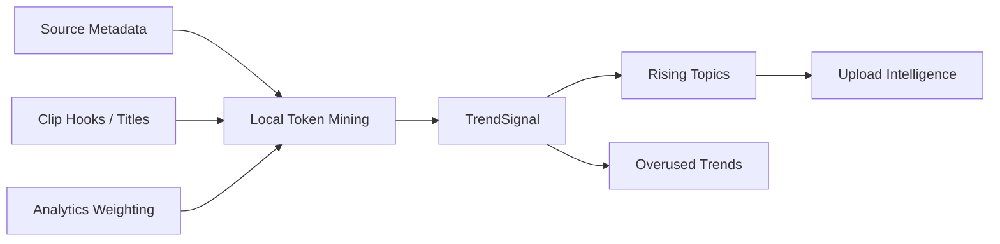
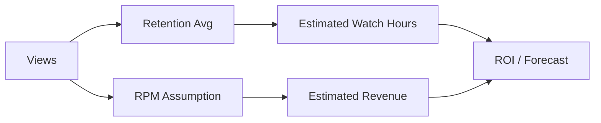
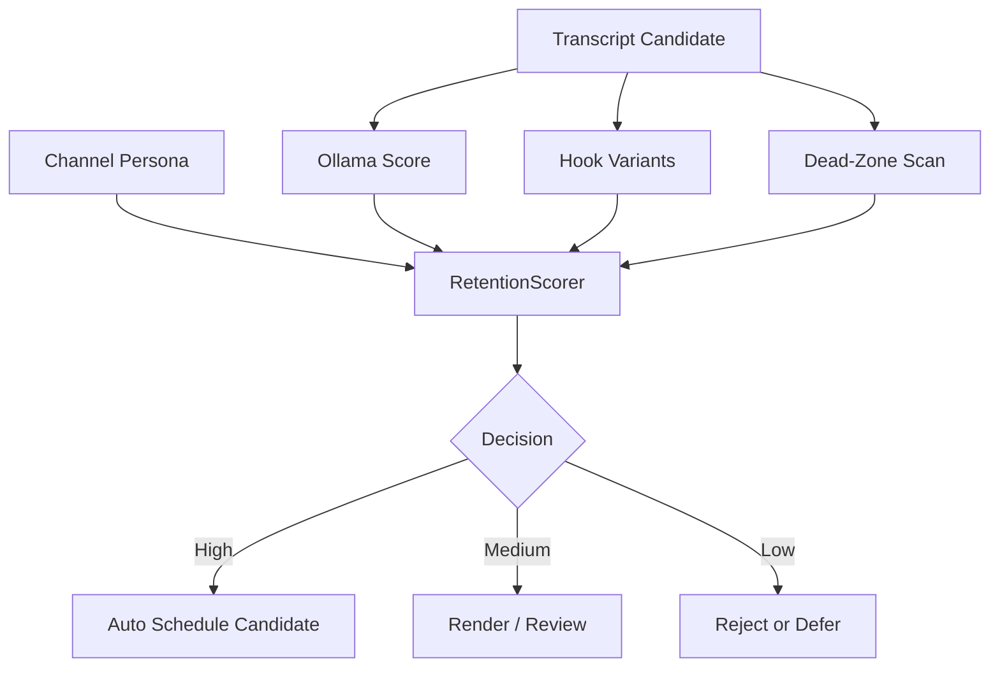
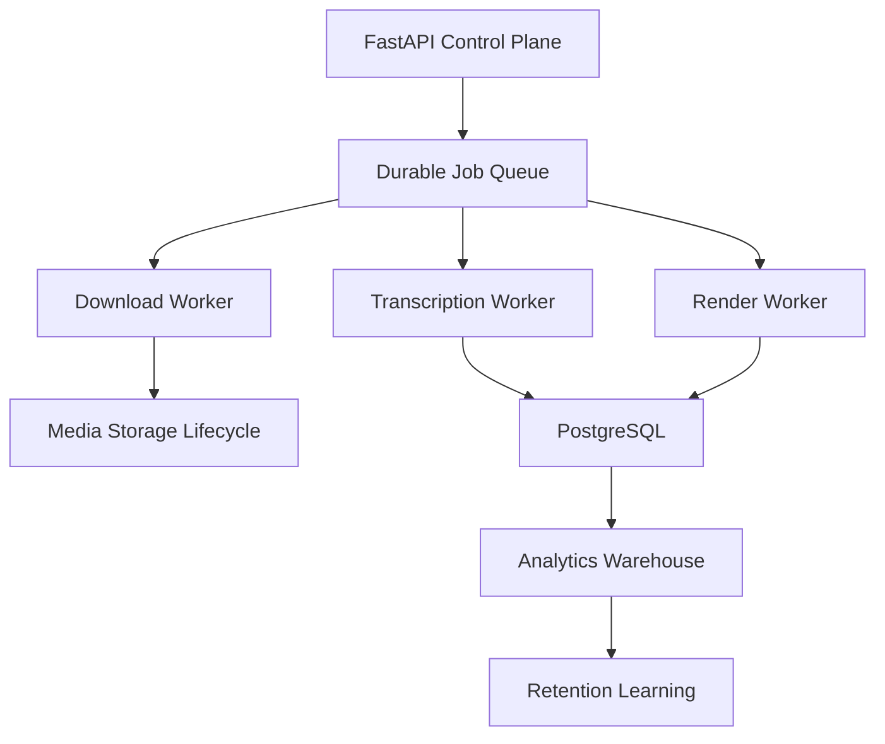

# AI Shorts / AI Media Platform - Full Deep Audit

**Audit date:** May 25, 2026  
**Project:** `ai_shorts_system`  
**Scope:** architecture, scalability, reliability, retention intelligence, dashboard UX, product strategy, monetization, YouTube survivability, technical debt, and SaaS potential.

## Executive Summary

The system is a credible local-first prototype for automating the mechanics of Shorts creation. It has a real pipeline boundary: monitor source channels, download with `yt-dlp`, extract audio through FFmpeg, transcribe with whisper.cpp, detect clips with Ollama plus heuristics, generate captions/subtitles, render a vertical MP4, queue uploads, and show a React/Tailwind dashboard. That is meaningful.

The hard truth: it is not yet a true self-improving retention engine. The current database contains one channel and one channel profile, but zero persisted videos, clips, clip intelligence records, analytics snapshots, uploads, revenue snapshots, trend signals, or learning events. The local `data/training/*.jsonl` files are empty. The successful `final_short.mp4` exists on disk, but it is not represented in the database learning loop. As a result, most current "learning" dashboards are priors, fallback examples, demo rows, or heuristic estimates rather than validated performance intelligence.

The project can become valuable, but only if it pivots from "autonomous repost machine" toward "permissioned creator content operating system." The highest risk is not compute. It is YouTube survivability: reused-content monetization risk, copyright/Content ID exposure, repetitive mass-produced channel patterns, and low originality signals.

## Evidence Snapshot

- Repository application code inspected across `app/`, `database/`, dashboard frontend, and `test_pipeline.py`.
- Approximate local source footprint: 14,308 lines across 81 files.
- Runtime artifact present: `data/clips/final_short.mp4` (5.8 MB).
- Training dataset exports present but empty: `clip_outcomes.jsonl`, `successful_clips.jsonl`, `failed_clips.jsonl`, `hook_performance.jsonl`, `dead_zone_patterns.jsonl`.
- SQLite database state observed: `channels=1`, `channel_profiles=1`, all clip/analytics/learning/revenue/upload/trend tables at `0`.

## Core Shorts Pipeline



## Retention Intelligence Engine



## Learning Feedback Loop



## Multi-Channel Architecture



## Dashboard System



## Upload / Review Workflow



## Trend Detection Flow



## Revenue Estimation Flow



## AI Decision Engine



## Future Scaling Architecture



## Database Relationship Diagram

```mermaid
erDiagram
  Channel ||--o{{ Video : has
  Video ||--o{{ Clip : produces
  Clip ||--o{{ Upload : queues
  Clip ||--o{{ AnalyticsSnapshot : measures
  Channel ||--|| ChannelProfile : strategy
  Clip ||--|| ClipIntelligence : scores
  Clip ||--o{{ LearningEvent : trains
  Channel ||--o{{ SourceFeed : monitors
  Clip ||--o{{ RevenueSnapshot : estimates
  Clip ||--o{{ UploadRecommendation : recommends
```

## Key Verdict

This is best viewed today as a strong local automation prototype and a promising internal tool for repurposing owned or permissioned long-form content. It is not yet safe or economically proven as an autonomous AI media company, and it is not ready as a SaaS product until it has job isolation, authentication, migrations, validated analytics feedback, explicit rights/originality workflows, and a less misleading intelligence dashboard.

## Official Policy Sources Used

- YouTube channel monetization policies: https://support.google.com/youtube/answer/1311392
- YouTube Shorts monetization policies: https://support.google.com/youtube/answer/12504220
- YouTube Partner Program overview and eligibility: https://support.google.com/youtube/answer/72851
- YouTube spam/deceptive practices policies: https://support.google.com/youtube/answer/2801973
- Fair use on YouTube: https://support.google.com/youtube/answer/9783148
- YouTube Data API videos.insert: https://developers.google.com/youtube/v3/docs/videos/insert
- YouTube Data API quota calculator: https://developers.google.com/youtube/v3/determine_quota_cost
